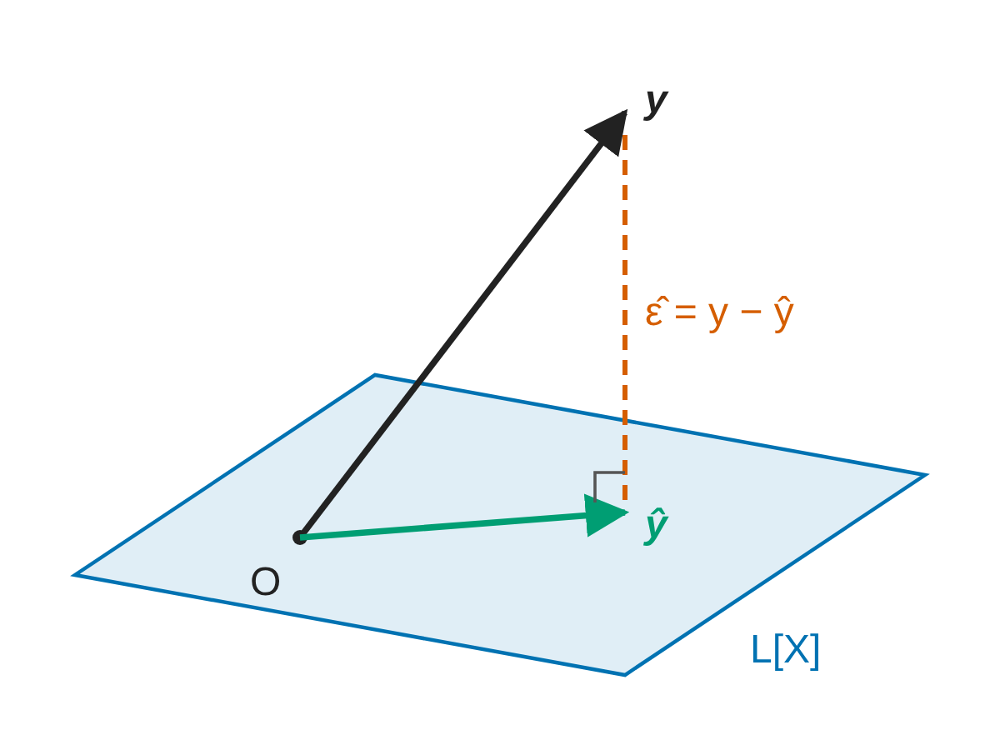

#+TITLE: 講義スライドのサンプル
#+SUBTITLE: lecture.org (revealjs / pdf / html) で使う書き方の一覧
#+AUTHOR: 村田 昇
#+EMAIL: noboru.murata@gmail.com
#+DATE:
#+STARTUP: hidestars content indent
:QUARTO:
#+SETUPFILE: _quarto/org/lecture.org
# slide01〜03 (Rによるデータ解析・数学的準備・回帰分析) から，使っている機能を含む頁を集めた
# C-c C-x C-v でinlineを切り替え
# <m C-i でlatex block (math env用)
# C-c '
:END:

* COMMENT メモ
- COMMENT の付いた見出しは書き出されない (使わなくなった頁もこの形で残す)
- 第 1 階層 (*) は節扉，第 2 階層 (**) が通常のスライド，第 3 階層 (***) は縦に続くスライド
- 節扉は見出しをそのまま出す (lecture.yaml は section-toc を使わない)

   
* Preamble                                                           :ignore:
#+begin_src R
  ### サンプル 資料
#+end_src
#+include: "preamble.R" src R
#+begin_content-visible :when-format "pdf"
#+begin_export latex
\figfitboth
\setlength{\figmaxheight}{0.42\textheight}
\setlength{\figmaxwidth}{0.84\textwidth}
#+end_export
#+end_content-visible

* 講義の内容
- 文字と数式
   - 箇条書き・強調・順に表示
   - 定義・定理の枠 (callout)
   - 数式と文字の大きさ
- 図と表
   - 図と説明を左右に並べる
   - R の表 (html と pdf で出し分け) と図
   - 画像・org の表
- コードと演習

* 文字と数式
** 箇条書きと強調
- 箇条書きは字下げで入れ子にする
   - *太字* で用語を示す (全角の句読点の直前では効かないので空白を入れる)
   - ~関数名()~ や ~File > Save~ はコード体で書く
   - リンク: [[https://quarto.org][Quarto]]，URL をそのまま書いても良い https://www.r-project.org
- 番号付きの箇条書き
   1. 帰無仮説を立てる
   2. 検定統計量を計算する
- 順に表示する (~#+attr_reveal: :frag (appear)~)
   #+attr_reveal: :frag (appear)
   - 何回か投げてみる
   - 表が裏より出やすければ「いかさま」と判断する
   - どのくらい表が出たら怪しいと考えられるだろうか?

** 定義と定理の枠
#+begin_callout-important :icon false :title "定義"
*p値* は観測された値を使った検定の第一種の過誤の確率として定義される
#+end_callout-important

#+begin_callout-note :icon false :title "連続分布を記述する方法"
- 確率密度関数 \(p(x)\)
- 累積分布関数 \(F(x)=\int_{-\infty}^{x}p(t)\,dt\)
#+end_callout-note

- 枠の種類: ~callout-note~ / ~-tip~ / ~-important~ / ~-warning~ / ~-caution~ ，種類なしの ~callout~
- 枠ごとの文字の大きさ: ~:class "text-85"~

** 数式
- 文中の数式 \(\mu=0,\sigma=1\)，別行立ての数式
   \begin{equation}
     p(x)
     =
     \frac{1}{\sqrt{2\pi}\sigma}e^{-\frac{(x-\mu)^{2}}{2\sigma^{2}}}
   \end{equation}
- 複数行の数式 (~align~)
   \begin{align}
     f(x)&=\frac{1}{1+x^{2}},\quad x\in[0,1]\\
     g(x)&=\exp\left( -\frac{x^{2}}{2} \right),\quad x\in\mathbb{R}
   \end{align}

** 文字と数式の大きさ
:PROPERTIES:
:QUARTO_ATTR: {.text-90}
:END:
- 見出しに ~{.text-90}~ を付けるとスライド全体の文字が 90% になる
- ブロックで一部だけ変える (50〜150% は 5 刻み，160〜200% は 10 刻み)
#+begin_text-80
- ~#+begin_text-80~ で囲んだ部分は 80% (入れ子は掛け算．同じ名前の入れ子は不可)
#+end_text-80
- 数式だけ小さくする: ~#+begin_math-75~
   #+begin_math-75
   \begin{equation}
     p(\boldsymbol{x})
     =\frac{1}{\sqrt{(2\pi)^p|\Sigma|}}
     e^{-\frac{1}{2}(\boldsymbol{x}-\boldsymbol{\mu})^{\mathsf{T}}
       \Sigma^{-1}(\boldsymbol{x}-\boldsymbol{\mu})}
   \end{equation}
   #+end_math-75
- 脚注は欄外に小さく出る[fn:1]

* 図と表
** 図と説明を並べる
#+begin_columns
#+attr_quarto: :width "45%"
#+begin_column
#+begin_fig-tall
#+begin_src R
  #| fig-cap: "正規分布 (平均0,分散1)"
  ggplot() +
    geom_function(fun = \(x) dnorm(x,mean = 0,sd = 1),
                  colour = "red", linewidth = 2) +
    xlim(-4, 4) + ylim(0, 0.4) +
    labs(x = "x", y = "確率密度")
#+end_src
#+end_fig-tall
#+end_column

#+attr_quarto: :width "55%"
#+begin_column
- 標本空間 : \((-\infty,\infty)\)
- 母数 : 平均 \(\mu\), 分散 \(\sigma^{2}\)
- 密度関数 :
   #+begin_math-85
   \begin{equation}
     p(x)
     =
     \frac{1}{\sqrt{2\pi}\sigma}e^{-\frac{(x-\mu)^{2}}{2\sigma^{2}}}
   \end{equation}
   #+end_math-85
- 備考 : \(\mu=0,\sigma=1\) のとき
   *標準正規分布* と呼ぶ．
#+end_column
#+end_columns

** 例 : 体重と脳の重さの関係
- R で作った表 (gt) を html ではスクロール枠に入れ，pdf では LaTeX の表にする
#+begin_src R
  #' 表の作成
  bb_data <-
    Animals |>
    rownames_to_column() |>
    as_tibble() |>
    set_names("種","体重[kg]","脳の重さ[g]")
  bb_tbl <-
    bb_data |>
    gt() |>
    tab_header(
      title = "体重と脳の重さ"
    )
#+end_src

#+begin_content-visible :when-format "html"
#+begin_scroll-tall
#+begin_src R
  bb_tbl
#+end_src
#+end_scroll-tall
#+end_content-visible

#+begin_content-visible :when-format "pdf"
#+begin_src R
  bb_tbl |>
    tab_options(table.font.size = 11,
                heading.title.font.size = "normal",
                heading.subtitle.font.size = "small",
                table.width = pct(50),
                latex.tbl.pos = "h") |>
    as_latex()
#+end_src
#+end_content-visible

*** 体重と脳の重さの関係 (対数変換)
:PROPERTIES:
:QUARTO_ATTR: {.head-center .fig-tall}
:END:
#+begin_src R
  #| fig-width: 6
  bb_data |>
    ggplot(aes(`体重[kg]`, `脳の重さ[g]`)) +
    geom_point(colour = alpha("royalblue", 0.75)) +
    geom_text_repel(aes(label = `種`), size = 3) + # 各点の名前を追加
    scale_x_log10() + scale_y_log10() + # log-log plot を指定
    geom_smooth(method = "lm", colour = "dodgerblue", fill = "dodgerblue")
#+end_src

** 画像と org の表
#+begin_columns
#+attr_quarto: :width "50%"
#+begin_column
#+caption: \(n=3\) , \(p+1=2\) の場合の最小二乗法による推定
#+name: fig-projection
#+attr_quarto: :width "90%" :fig-align "center"

#+end_column

#+attr_quarto: :width "50%"
#+begin_column
#+caption: 代表的なデータ型
| 型の名称     | 役割             | 例                      |
|-------------+------------------+-------------------------|
| ~numeric~   | 実数を表す         | ~1, pi, NaN~            |
| ~character~ | 文字列を表す       | ~"foo"~                 |
| ~logical~   | 論理値(真偽)を表す | ~TRUE, FALSE, NA~       |
#+end_column
#+end_columns

-----

- ~-----~ (5 つ以上の -) でスライドを区切ると，同じ見出しの続きのスライドになる
- 図は @fig-projection のように番号で参照できる

* コード
** コードを見せる
- 実行せずにコードだけ見せる (~:echo true :eval false~)
  #+attr_quarto: :echo true :eval false
  #+begin_src R
    #' 関数 function() の使い方 (擬似コード)
    関数名 <- function(引数){ # 計算ブロックの開始
      return(返値) # 計算結果を明示的に示す
    } # ブロックの終了
  #+end_src
- R 以外の言語は色付けのみ
  #+begin_src yaml
    ---
    format:
      html:
        self-contained: true
    ---
  #+end_src

** 実行結果を見せる
- コードと結果の両方を見せる (~:echo true~)
  #+begin_src R :exports none
    #' @exercise スライドには出ないチャンク (R スクリプトにだけ残す)
  #+end_src
  #+attr_quarto: :echo true
  #+begin_src R
    #' 縦の長さ a, 横の長さ b (既定値は1) の長方形の面積
    foo <- function(a, b = 1) a * b
    foo(2, 3) # foo(a = 2, b = 3) と同義
    foo(2)    # foo(a = 2, b = 1) と同義
  #+end_src

* 演習
:PROPERTIES:
:QUARTO_ATTR: {background-color="#fef4f4"}
:END:
** 問題
- R の関数 integrate() についてヘルプを調べなさい．
- 以下の関数の定積分を求めなさい．
  \begin{align}
    f(x)&=\frac{1}{1+x^{2}},\quad x\in[0,1]\\
    g(x)&=\exp\left( -\frac{x^{2}}{2} \right),\quad x\in\mathbb{R}
  \end{align}

** 解答例
- 関数 integrate() を利用して定積分を計算
  #+attr_quarto: :echo true
  #+begin_src R
    #' 関数 1/(1+x^2) を区間 [0,1] で積分
    f <- function(x) 1/(1+x^2)
    integrate(f, 0, 1) # pi/4
    #' 関数 e^(-x^2/2) を実軸全体で積分 (Gauss積分)
    integrate(\(x) exp(-x^2/2), -Inf, Inf) # sqrt(2*pi)
  #+end_src

** COMMENT 解答例 (配布前は COMMENT にしておく)

* 次回の予定
- *第1回 : 回帰モデルの考え方と推定*
- 第2回 : モデルの評価
- 第3回 : モデルによる予測と発展的なモデル

* Footnotes                                                          :ignore:
[fn:1] 脚注はスライドの下に区切り線付きで出る (pdf では通常の脚注)
