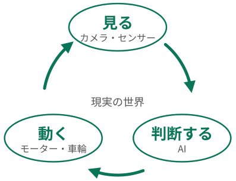

#+TITLE: 講演スライドのサンプル
#+SUBTITLE: talk.org で使う書き方の一覧 (「物理を組み込む機械学習」から抜粋)
#+AUTHOR: 村田 昇
#+EMAIL: noboru.murata@gmail.com
#+DATE:
#+STARTUP: hidestars content indent
#+OPTIONS: ^:{}
:QUARTO:
#+SETUPFILE: _quarto/org/talk.org
# 配色: jade (既定) / indigo / lavender / burgundy / dracula．make palettes で全部を書き出す
#+QUARTO_PALETTE: burgundy
# 修飾: logo (見出しの左にロゴ，題は右寄せ) / pin (見出しを上に固定し，本文だけを中央に)．空白で区切って並べる
#+QUARTO_DECK: logo
# 配布用 PDF (make talk-notes / tools/oxq-pdf.py) の割り付け: 有効にするには行頭の "# " を消す
#   notes-pdf-layout: stack (既定．上にスライド・下にノート，1 頁 2 枚) / side (左にスライド・右にノート)
#   notes-pdf-engine: typst (既定) / lualatex (jlreq) / xelatex．ほかに notes-pdf-per-page:3，notes-pdf-keep:true (tex を残す)
# #+QUARTO_OPTIONS: notes-pdf-layout:side notes-pdf-engine:lualatex
#+BIBLIOGRAPHY: talk-sample.bib
# 図の数値は data/*.csv を読むだけ (talk/piml.org と同じ)．SVG の図は figs/
:END:

* COMMENT メモ
- talk/piml.org から，機能を含むスライドを抜き出したもの
- 梗概 {.overview}: 第 1 階層の見出しと summary 属性から一覧を自動で作る (_quarto/lib/section-toc.lua)
- 節扉: 第 1 階層の見出し．現在の節を強調した一覧になる (題を出す {.show-title}，一覧なし {.no-toc}，地色 {.light})
- 引用したスライドでは脚注欄に書誌が出る (3 件以上は出さない．{.no-cite-aside} / {.cite-aside})
- 発表者ノートは #+begin_notes (S キーで表示)
- 大きな数値は #+begin_kpi，列の間の矢印は :class "flow-arrow"，定式化の表は {.formulation}

* Preamble                                                           :ignore:
#+include: "preamble-talk.R" src R

* 講演の流れ
:PROPERTIES:
:QUARTO_ATTR: {.overview}
:END:

#+begin_notes
講演全体の流れ．各節の扉には同じ一覧が出て，いまどこにいるかが濃い色で示される．
一覧は org に書かなくてよい: 第 1 階層の見出しとその summary 属性から _quarto/lib/section-toc.lua が自動で作る．
#+end_notes

* フィジカルAI
:PROPERTIES:
:QUARTO_ATTR: {summary="現実世界で動く AI が目指すものと，物理の知識が担う役割"}
:END:

** フィジカルAIとは
#+begin_columns
#+attr_quarto: :width "50%"
#+begin_column
#+begin_callout-note :icon false :title "定義" :class "text-100"
画面の中で文章や画像を扱うだけでなく，
*現実の世界で，見て・判断して・動く* AI
#+end_callout-note

- 家庭や工場で働くロボット，自動運転車，ドローン
- [2020 年ごろから学術的に提唱され [cite:@Miriyev_Kovac_2020_SkillsPhysicalArtificial]，近年は産業界でも関心が急速に高まっている]{.muted}
#+end_column

#+attr_quarto: :width "50%"
#+begin_column
#+attr_quarto: :width "100%"

#+end_column
#+end_columns

#+begin_notes
【定義】フィジカルAI (Physical AI) は，デジタル空間 (ソフトウェア) での計算や情報処理にとどまる従来の AI と異なり，現実の物理空間で自律的に知覚し，判断し，行動する AI システムとその技術領域を指す．
従来の AI が主に文章・画像・音声などのデジタルデータの処理に特化していたのに対し，フィジカルAI はロボット・自動運転車・ドローンなどを制御し，「現実の世界で動く」身体を持った知能である．
【見る → 判断する → 動く (右図)】カメラやセンサーで周りの様子をとらえ (知覚)，AI が次の行動を決め (判断)，モーターや車輪で実際に動く (行動)．動けば周りの様子が変わるので，それをまた見て判断し直す (図の時計回りの矢印．図は figs/cycle-pai.svg)．この繰り返しを現実の時間の中で止めずに続けることが，画面の中の AI との大きな違いである．
【出典】Miriyev と Kovač (Nature Machine Intelligence, 2020) は，フィジカルAI を「材料科学・機械工学・計算機科学・生物学などの技能を融合させ，生き物のような知能を持つロボットを作るための理論と実践」と定義した．近年は産業界でも関心が急速に高まっている．
【この講演での位置付け】フィジカルAI は導入の題材であり，主題はそれを支える要素の一つである「物理を学習に組み込む機械学習 (PIML)」である．
#+end_notes

** 実現に必要なもの

#+begin_columns
#+attr_quarto: :width "32%"
#+begin_column
#+begin_callout-note :icon false :title "考える頭" :class "text-100"
映像と言葉から，次にどう動くかを決める大きな AI

[(VLA モデル)]{.muted}
#+end_callout-note
#+end_column

#+attr_quarto: :width "32%"
#+begin_column
#+begin_callout-note :icon false :title "仮想の練習場" :class "text-100"
コンピュータの中で何度も練習してから，実機に移す

[(シミュレーション，Sim-to-Real)]{.muted}
#+end_callout-note
#+end_column

#+attr_quarto: :width "32%"
#+begin_column
#+begin_callout-note :icon false :title "身体を知る" :class "text-100"
機体の大きさや力の限界，重心を踏まえて動く

[(身体性)]{.muted}
#+end_callout-note
#+end_column
#+end_columns

- [3 つの整理は学術・産業界の議論による[fn:core]]{.muted}

#+begin_notes
フィジカルAI を支える技術は大きく 3 つに整理できる．ここでは用語より役割を伝えることを優先し，専門用語は括弧の中に小さく添えた．
【考える頭】VLA モデル (Vision-Language-Action)．カメラ画像と言葉の指示を入力とし，文章ではなくロボットの関節やモーターへの動作の指令を出力する大規模な基盤モデル．
【仮想の練習場】デジタルツインと Sim-to-Real．重力や摩擦などを模した仮想空間で高速に何百万回もの練習 (強化学習) を行い，身に付けた動かし方を現実の機体に移す．実機で試行錯誤するより速く，安全で，安い．
【身体を知る】身体性 (Embodiment)．腕の長さ・モーターの力・重心・慣性など機体ごとの制約を踏まえ，物理法則に沿った動きをその場で計算する能力．
3 つ目の「物理法則に沿った動き」が，この講演で扱う PIML と最も直接につながる．ただし 2 つ目の練習場の精度や，1 つ目の判断の妥当性にも物理の知識は関わる (次の 2 枚)．
#+end_notes

* PIML の全体像
:PROPERTIES:
:QUARTO_ATTR: {summary="正則化としての物理，3 つの入れ場所，PINN と PINO の定式化と研究の流れ"}
:END:

** 研究の流れ
#+begin_text-85
#+begin_columns
#+attr_quarto: :width "22%"
#+begin_column
#+begin_callout :icon false :title "1. 従来型 AI" :class "text-80"
- デジタル空間の知識表現 (LLM 等)
- 固定環境向けのルール記述
#+end_callout
#+end_column

#+attr_quarto: :width "4%" :class "flow-arrow"
#+begin_column
→
#+end_column

#+attr_quarto: :width "22%"
#+begin_column
#+begin_callout-tip :icon false :title "2. PIML / PINN" :class "text-80"
- 物理法則を損失に組み込む
- 点 → 状態量の写像
- 小データでも物理的に妥当
#+end_callout-tip
#+end_column

#+attr_quarto: :width "4%" :class "flow-arrow"
#+begin_column
→
#+end_column

#+attr_quarto: :width "22%"
#+begin_column
#+begin_callout-tip :icon false :title "3. NO" :class "text-80"
- FNO / PINO
- 関数 → 関数の写像
- 解像度に依存しない高速推論
#+end_callout-tip
#+end_column

#+attr_quarto: :width "4%" :class "flow-arrow"
#+begin_column
→
#+end_column

#+attr_quarto: :width "22%"
#+begin_column
#+begin_callout :icon false :title "4. フィジカルAI" :class "text-80"
- VLA・Sim-to-Real・身体性と統合
- 現実空間で安全に自律行動
#+end_callout
#+end_column
#+end_columns

#+end_text-85

#+begin_center
[└──── 本講演で扱う範囲 ────┘]{.accent}
#+end_center

#+begin_notes
研究のパラダイムの変化を 4 段階で整理した．
1. 従来型 AI・古典ロボティクス: デジタル空間に閉じた知識表現 (LLM など) や，固定環境向けのルールの記述．
2. PIML / PINN: 偏微分方程式などの物理法則を損失関数に組み込み，点 (座標) から状態量への写像を学習する．小データでも物理的に妥当な解が得られる．
3. NO (Neural Operator．FNO / PINO): 点ごとの予測から「関数空間から関数空間への写像」の学習へ進む．例えば粗い暫定経路 (関数) を滑らかな軌道 (関数) に一度の推論で変換でき，推論は解像度に依存しない．
4. フィジカルAI: PIML や作用素学習による物理・幾何の生成能力が，VLA・Sim-to-Real・身体性の制御と統合され，現実空間で安全に自律行動するシステムになる．
本講演はこのうち 2 から 3 への進化 (図の緑の 2 つ) を，制約付き曲線の設計を例に段階的に辿る．問題を少しずつ難しくし，そのたびに新しい技術が必要になる様子を計算で示す．
#+end_notes

* 例題: 制約付き曲線の設計
:PROPERTIES:
:QUARTO_ATTR: {summary="道路の曲線を題材に，問題を少しずつ難しくして技術の必要性を確かめる"}
:END:

** 問題3 同定: 測量点から曲線を推定する
#+begin_columns
#+attr_quarto: :width "55%"
#+begin_column
#+begin_callout-important :icon false :title "問題3" :class "text-85"
曲率が弧長に比例する曲線の上で，前半の 5 点を測量した座標 (誤差 5 cm 程度) が与えられたとき，パラメータ \(A\) と，\(0\)〜\(80\) m の経路 \((x(s),y(s))\) を求めなさい．
#+end_callout-important
#+begin_math-80
\begin{align}
  \kappa(s)&=\frac{s}{A^2},\quad (x,y,\varphi)(0)=(0,0,0)\\
  s_k&=0,10,\dots,40\ \mathrm{m}\ \ \text{で}\ (x_k,y_k)\ \text{を観測}\\
  \sigma&=5\ \mathrm{cm}
\end{align}
#+end_math-80
#+end_column

#+attr_quarto: :width "45%"
#+begin_column
#+begin_src R
  #| fig-width: 5
  #| fig-height: 4.2
  pts <- read_piml("inverse_points.csv") |> filter(seed == 0)
  ggplot(pts, aes(x, y)) +
    annotate("rect", xmin = 40, xmax = 80, ymin = -Inf, ymax = Inf, fill = piml_col[["rule"]], alpha = 0.5) +
    annotate("text", x = 60, y = 6.5, label = "未測量区間\n(40〜80 m)", colour = piml_col[["soft"]],
             size = 4.5, lineheight = 0.9) +
    geom_point(colour = piml_col[["ink"]], size = 3.5) +
    annotate("text", x = 20, y = 2.2, label = "測量した 5 点\n(誤差 σ = 5 cm)", colour = piml_col[["ink"]],
             size = 4.5, lineheight = 0.9) +
    scale_x_continuous(limits = c(0, 80)) + scale_y_continuous(limits = c(-0.5, 8)) +
    labs(x = "x [m]", y = "y [m] (縦軸を拡大)")
#+end_src
#+end_column
#+end_columns

#+begin_notes
【要点】観測があるのは前半だけ → 後半は外挿 真値は問題1 の曲線 (\(A=109.54\) m)
【問題の意味】既設の道路の緩和曲線を一部だけ測量し，そこから曲線のパラメータを推定して，測っていない区間の線形を再現したい (逆問題・同定)．真値は問題1 と同じ曲線 (A = 109.54 m)．
測点は 0〜40 m の 5 点だけで，40〜80 m は未測量．各点に標準偏差 5 cm の誤差を加えた．観測のない区間をどう外挿するかが問題になる．
#+end_notes

*** 問題3 の定式化
:PROPERTIES:
:QUARTO_ATTR: {.formulation}
:END:
#+begin_text-100
| 項目 | 内容 |
|---+---|
| 学習器 | 問題1 と同じ: \((x,y,\varphi)(t)=t\,N_\theta(t)\) |
| 学習する量 | \(\theta\) と未知の係数 \(A\) |
| 方程式 \(\mathcal{L}_r\) | \(\langle\lvert r(t_i)\rvert ^2\rangle\)，\(\kappa=tL/A^2\) |
| 境界 \(\mathcal{L}_b\) | 始点: 構造 (終点の条件はない) |
| データ \(\mathcal{L}_d\) | \(\frac{1}{5}\sum_k\bigl\lvert (x,y)(s_k)-(x_k,y_k)^{\mathrm{obs}}\bigr\rvert ^2\)　(0〜40 m の 5 点) |
| 損失 | \(\mathcal{L}=\mathcal{L}_r+w_d\,\mathcal{L}_d\)，\(w_d=10,\,100,\,1000\) |
#+end_text-100

#+begin_text-85
- 比較: データのみの NN (\(\mathcal{L}=\mathcal{L}_d\))，非線形最小二乗 (\(A\) を変えて積分した曲線を 5 点に当てはめる)
#+end_text-85

#+begin_notes
【共通の記号】t = s/L ∈ [0, 1] (無次元の弧長)，′ = d/dt．方程式の残差 r = (x′ − L cos φ, y′ − L sin φ, φ′ − L κ)．⟨·⟩ はコロケーション点 t_i (128 点) での平均．L_r: 方程式の損失，L_b: 境界条件の損失，L_d: データの損失，L_s: 滑らかさの損失．第 2 節の「PINN と PINO の定式化」と同じ分け方で，すべての問題をこの表の形で示す．
【PINN の作り方】問題1 と同じ NN (出力 × t で始点を満たす) に，未知パラメータ A を加える．方程式の残差 r の 3 行目は φ' − L κ = φ' − L·(tL)/A² になり，A がここに入る．損失は方程式の残差の 2 乗平均に，測量点での位置の差の 2 乗平均を重み w_d で足したもの．A は正値を保つため対数で学習する．
【比べる方法】データのみの NN: 方程式の項を外し，5 点への当てはめだけで学習した NN．物理の知識を使わない場合の基準．非線形最小二乗: A を変えながら方程式を数値積分し，5 点との差の 2 乗和を最小にする古典的な方法．未知数が A の 1 つだけなので速く確実．
重み w_d は 10, 100, 1000 の 3 通り，乱数シードは 3 通り試した．最適化は Adam 4,000 回 → L-BFGS 300 回．
#+end_notes

*** 結果: 物理残差が外挿を支える
#+begin_columns
#+attr_quarto: :width "62%"
#+begin_column
#+begin_fig-tall
#+begin_src R
  #| fig-cap: "測点 0〜40 m の 5 点 (σ = 5 cm) から 80 m まで再現 (乱数シード 0)"
  #| fig-width: 6.5
  #| fig-height: 5
  cur <- read_piml("inverse_curves.csv") |>
    filter(seed %in% c(-1, 0), is.na(wd) | wd == 100) |>
    mutate(method = factor(method, levels = c("真の線形", "データのみ NN", "非線形最小二乗", "PINN")))
  pts <- read_piml("inverse_points.csv") |> filter(seed == 0)
  ggplot(cur, aes(x, y, colour = method, linetype = method)) +
    annotate("rect", xmin = 40, xmax = Inf, ymin = -Inf, ymax = Inf,
             fill = piml_col[["rule"]], alpha = 0.35) +
    annotate("text", x = 60, y = 7.5, label = "未測量区間", colour = piml_col[["soft"]]) +
    geom_path(linewidth = 1.2) +
    geom_point(data = pts, aes(x, y), inherit.aes = FALSE,
               colour = piml_col[["ink"]], size = 3) +
    scale_colour_manual(values = c(piml_col[["ink"]], piml_col[["alert"]],
                                   piml_col[["gray"]], piml_col[["primary"]])) +
    scale_linetype_manual(values = c("dashed", "solid", "solid", "solid")) +
    labs(x = "x [m]", y = "y [m] (縦軸を拡大)")
#+end_src
#+end_fig-tall
#+end_column

#+attr_quarto: :width "38%"
#+begin_column
#+begin_kpi :class "alert"
[2.8–3.4 m]{.kpi-value}
[データのみ NN．A は推定できない]{.kpi-label}
#+end_kpi

#+begin_kpi
[0.17–0.27 m]{.kpi-value}
[PINN (w_d = 100)．A = 107.4〜110.8 m]{.kpi-label}
#+end_kpi

#+begin_kpi :class "neutral"
[0.13–0.47 m]{.kpi-value}
[非線形最小二乗．A = 108.3〜113.4 m]{.kpi-label}
#+end_kpi

- → 物理の残差が観測のない区間を埋める (正則化としての物理)
#+end_column
#+end_columns

#+begin_notes
【問題】既設の緩和曲線 (R = 150 m，L = 80 m，A = 109.54 m) を 10 m 間隔で測量した座標から A を推定し，線形全体を再現する．
測点は 0〜40 m の 5 点のみで，各点に標準偏差 5 cm の誤差を加えた．40〜80 m は未測量区間で，ここをどう外挿するかが問題．
【方法】終端条件の代わりに測量点への適合項 (重み w_d) を使う．未知パラメータは A のみ (曲率の比例係数として学習)．比較対象は (a) 物理残差なしでデータだけに合わせた NN，(b) 非線形最小二乗 (A を ODE の積分でフィット)．
【結果】全区間 (0〜80 m) の位置誤差の最大値 (乱数シード 3 通り)．データのみの NN は未測量区間で真の線形から外れ 2.8〜3.4 m．PINN (w_d = 100) は 0.17〜0.27 m で，A = 107.4〜110.8 m．非線形最小二乗は 0.13〜0.47 m．
【解釈】物理残差は「観測のない区間でも方程式を満たせ」という制約で，外挿を支える．これは第 2 節の「正則化としての物理」の具体例である．
一方，未知数が 1 つで方程式が既知なら古典的な非線形最小二乗と精度は同等で，速さと安定性では古典手法が勝る．PINN の利点が出るのは，曲率分布そのものが未知関数の場合や，他の物理モデルと連成する場合 (問題4 以降)．
#+end_notes

* 課題とまとめ
:PROPERTIES:
:QUARTO_ATTR: {summary="例題で見えた課題と研究の動向"}
:END:

** まとめ
:PROPERTIES:
:QUARTO_ATTR: {background-color="#17211E"}
:END:
1. 物理残差は外挿を支える．
   データだけの NN の誤差 3 m 台が *0.2 m 台* に下がった
2. 未知が関数になると，物理を罰則から *構造 (積分層・射影)* に移すことが効く
3. 条件付き PINN・作用素学習で，1 件数十秒の最適化が *1 ms 未満* の推論になる
4. 走れる軌道には，凸最適化との分担か動特性の罰則が要る

#+begin_notes
(暫定版．標題とあわせて全体が固まってから見直す)
1. 物理残差は観測のない区間の外挿を支える (問題3)．ただし未知数が少ない問題では古典手法と同等で，速度では劣る．
2. 未知が関数になると，物理を罰則から構造 (積分層・射影) に移すことが効く (問題4)．損失の項が減り，重みの調整もいらなくなる．
3. 条件付き PINN・作用素学習で，1 件数十秒の最適化が 1 ms 未満の推論になる (問題5・6)．代償は解の質のわずかな低下．
4. 走れる軌道には，凸最適化との分担か動特性の罰則が要る (問題7a・7b)．
これらの技術は，関数近似理論・自動微分・スペクトル表現・正則化・数値解析という要素技術の発展の上に成り立っている．
#+end_notes

** 参考文献
:PROPERTIES:
:QUARTO_ATTR: {.scrollable .no-cite-aside}
:END:

#+begin_export markdown
::: {#refs}
:::
#+end_export

#+begin_notes
文献は talk-sample.bib (talk/piml.bib から抜き出したもの) から citeproc が自動で並べる．本文の ~[cite:@key]~ で引いた文献が載る．書式は _quarto/csl/apa.csl．
#+end_notes

* Footnotes                                                          :ignore:
[fn:core] [cite/t:@Miriyev_Kovac_2020_SkillsPhysicalArtificial] の定義，[cite/t:@Thakur_etal_2025_PhysicalArtificialIntelligence]，および NVIDIA による産業界での整理 (学習・シミュレーション・実行の 3 つの計算機，[[https://blogs.nvidia.com/blog/three-computers-robotics/][NVIDIA Blog]]) を参考にまとめた

